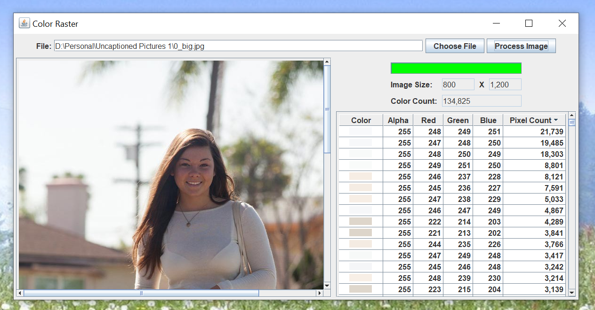

# Color Raster

## Introduction

I had trouble comming up with a name for this project.  This Java application reads through the pixels of an image, and counts the pixels by color.

Here's what the GUI looks like.

- Choose an image from your computer.
- Process the image and fill in the table.
- Sort the table by pixel count descending to see the most used colors.

I chose a photograph using 134,825 different colors.  I sorted the table to show the most used colors first.  The colors are displayed as both an image and with their alpha, red, green, and blue values.

The largest images I tested with took 2 seconds to process, so perhaps the progress bar wasn't needed.

## Explanation

Oracle has a helpful tutorial, [Creating a GUI With Swing](https://docs.oracle.com/javase/tutorial/uiswing/index.html).  Skip the Learning Swing with the NetBeans IDE section.  

I use the [model-view-controller (MVC)](https://en.wikipedia.org/wiki/Model%E2%80%93view%E2%80%93controller) pattern when I code a Java Swing application.  The MVC pattern looks like this in Java Swing:

- The model consists of one or more plain Java getter/setter classes.  The GUI reads the model.  The GUI does not update the model.  The model interacts with files and/or databases.
- The view consists of one `JFrame` and as many `JPanels` and `JDialogs` as necessary.
- The controllers consist of the Java Swing `Actions` and `Listeners`.  The controllers write to the model and update the view.  You can have as many controllers as you need.

The Color Raster application has 4 model classes, 4 view classes, and 3 controller classes.
